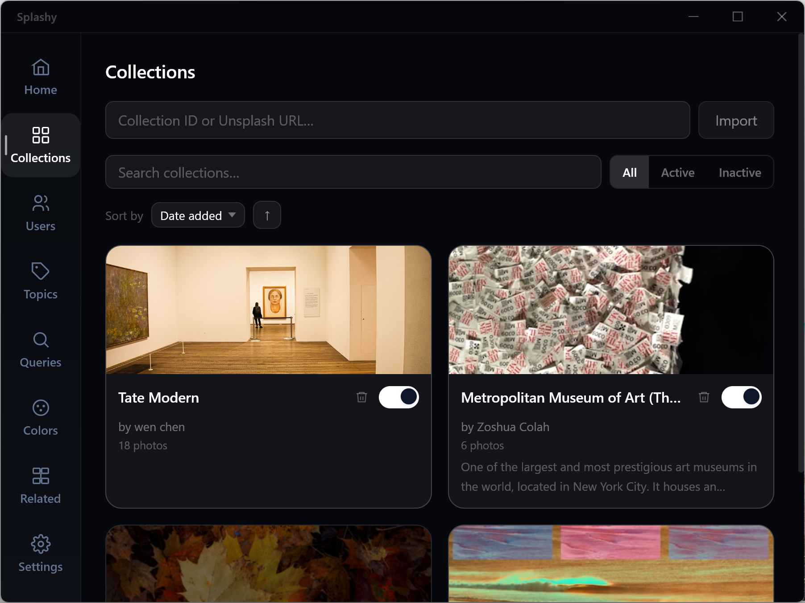
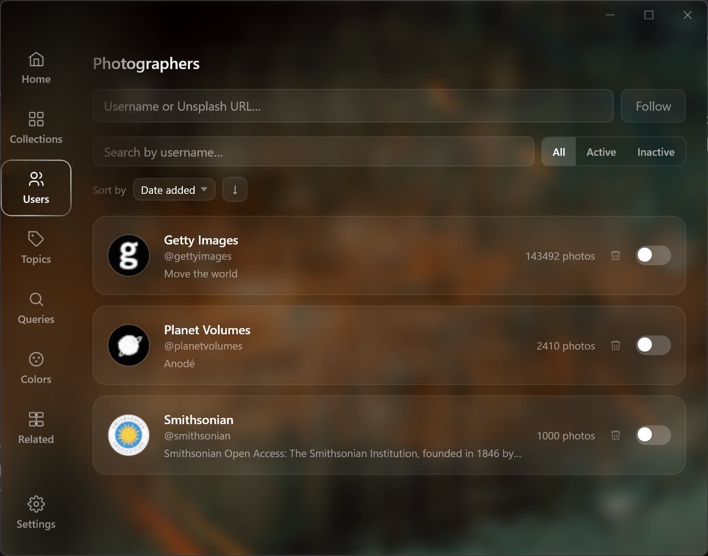
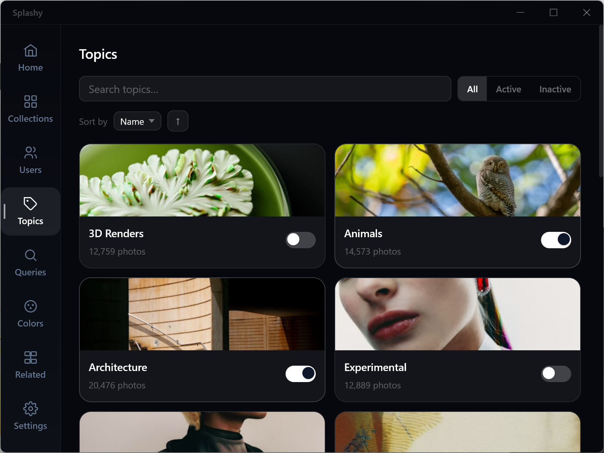
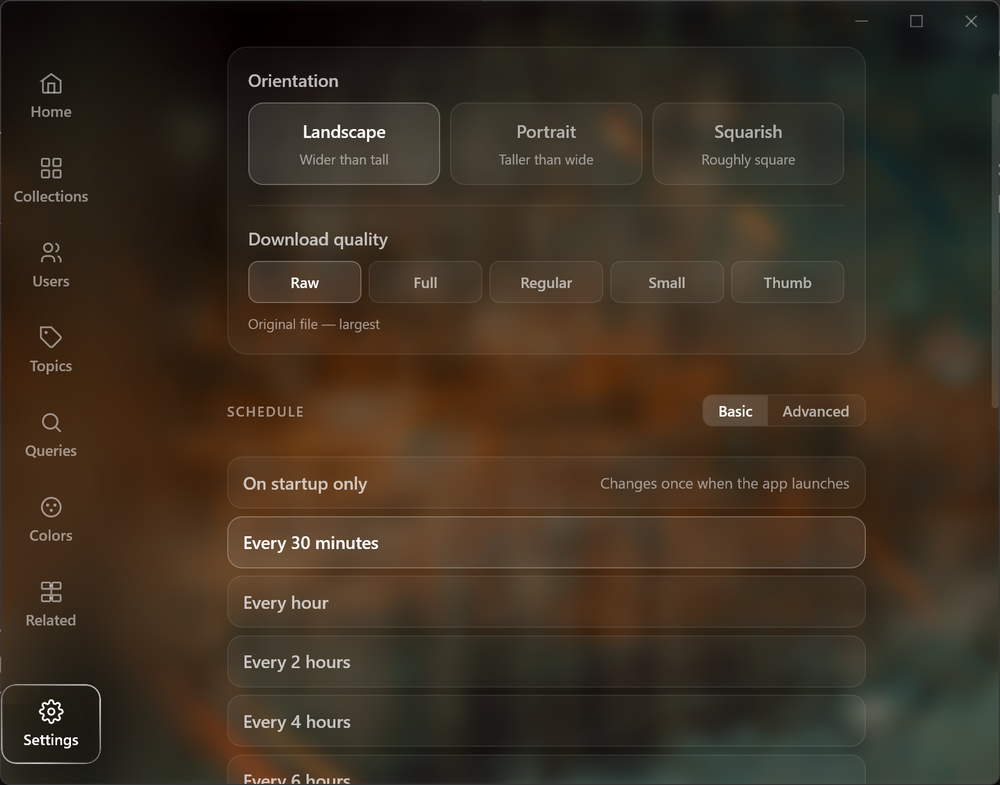

# Splashy

A beautiful desktop wallpaper app powered by [Unsplash](https://unsplash.com). Automatically rotates your wallpaper on a schedule from your favourite collections, photographers, topics, colours, or search queries.


---

## Features

- **Automatic rotation** - change your wallpaper on a schedule (every 30 min, hourly, once a day at a specific time, or a custom expression)
- **Multiple sources** - pull from Unsplash collections, photographers, topics, colours, or keywords and mix them however you like
- **Collections** - import any public Unsplash collection by URL or ID
- **Photographers** - follow your favourite Unsplash photographers and use their latest work
- **Topics and Colours** - browse curated Unsplash topics or filter by colour palette
- **Save wallpapers** - permanently save any wallpaper you like to your Pictures folder
- **Photographer credit** - every wallpaper shows who took it and links to their Unsplash profile
- **Runs in the tray** - stays out of your way; accessible from the system tray at any time
- **Start on login** - optionally launch silently on startup

---

## Screenshots

### Collections
Import any public Unsplash collection and use it as a wallpaper source.



### Photographers
Follow your favourite Unsplash photographers and pull from their work.



### Topics
Browse curated Unsplash topics and enable them as wallpaper sources.



### Settings
Control the rotation schedule, image quality, orientation, and more.



---

## Installation

Download the latest installer for your platform from the [Releases](../../releases/latest) page:

| Platform | File |
|---|---|
| Windows | `Splashy_x.x.x_x64-setup.exe` or `.msi` |
| macOS (Apple Silicon) | `Splashy_x.x.x_aarch64.dmg` |
| macOS (Intel) | `Splashy_x.x.x_x64.dmg` |
| Linux | `.deb`, `.rpm`, or `.AppImage` |

### macOS note
The app is not notarised. If macOS blocks it, run:
```bash
xattr -cr /Applications/Splashy.app
```

---

## Setup

1. Get a free Unsplash API key at [unsplash.com/developers](https://unsplash.com/developers) - create an app and copy the **Access Key**
2. Open Splashy, go to Settings and paste your key
3. Add a source (collection, photographer, topic, colour, or query)
4. Hit **Refresh** or wait for the scheduler to kick in

---

## Built with

- [Tauri](https://tauri.app) - Rust + WebView desktop framework
- [React](https://react.dev) + [TypeScript](https://www.typescriptlang.org)
- [Unsplash API](https://unsplash.com/developers)

---

## Support

If you enjoy Splashy, consider buying me a coffee

[](https://buymeacoffee.com/halfaxa)

---

## License

This project is licensed under the [MIT License](./LICENSE).
